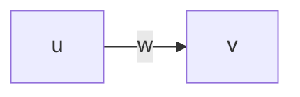
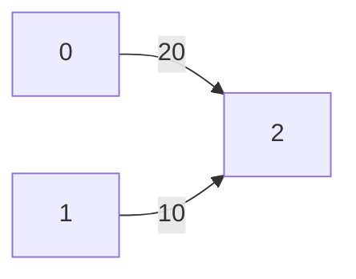

# Graph

## Introduction

In computer science, a graph is an abstract data type that is meant to implement the undirected graph and directed 
graph concepts from the field of graph theory within mathematics.

A graph data structure consists of a finite (and possibly mutable) set of vertices (also called nodes or points), 
together with a set of unordered pairs of these vertices for an undirected graph or a set of ordered pairs for a 
directed graph. These pairs are known as edges (also called links or lines), and for a directed graph are also known 
as edges but also sometimes arrows or arcs.

A graph data structure may also associate to each edge some edge value, such as a symbolic label or a
numeric attribute (cost, capacity, length, etc.). [Wikipedia](https://en.wikipedia.org/wiki/Graph_(abstract_data_type))

## Aim

The aim of the project is to act as a reference for **implementation** of various graph algorithms in Java. The project 
does not aim to act as a resource for learning about any algorithm. It only demonstrates one of the ways to implement
them.

## Table of Contents

> * [Title](#Graph)
> * [Introduction](#introduction)
> * [Aim](#aim)
> * [Table of Contents](#table-of-contents)
> * [Algorithm List](#algorithm-list)
> * [Representation Used](#representation-used)
> * [Source Code](#source-code)

## Algorithm List

* [Connected Components](Graph/ConnectedComponents.java)
  * [Undirected Graph](https://github.com/AKSingh18/Graph/blob/2770f097681b355cf6bc76360c163fb58614bc0b/Graph/ConnectedComponents.java#L13)
    * [DFS](https://github.com/AKSingh18/Graph/blob/2770f097681b355cf6bc76360c163fb58614bc0b/Graph/ConnectedComponents.java#L29)
    
  * [Directed Graph](https://github.com/AKSingh18/Graph/blob/2770f097681b355cf6bc76360c163fb58614bc0b/Graph/ConnectedComponents.java#L60)
    * [Weakly Connected Components](https://github.com/AKSingh18/Graph/blob/2770f097681b355cf6bc76360c163fb58614bc0b/Graph/ConnectedComponents.java#L72)
    * [Kosaraju](https://github.com/AKSingh18/Graph/blob/2770f097681b355cf6bc76360c163fb58614bc0b/Graph/ConnectedComponents.java#L90)
    * [Tarjans](https://github.com/AKSingh18/Graph/blob/2770f097681b355cf6bc76360c163fb58614bc0b/Graph/ConnectedComponents.java#L176)
    
* [Critical Points and Bridges](Graph/CriticalPointsAndBridges.java)
  * [Articulation Points](https://github.com/AKSingh18/Graph/blob/2770f097681b355cf6bc76360c163fb58614bc0b/Graph/CriticalPointsAndBridges.java#L27)
  * [Bridges](https://github.com/AKSingh18/Graph/blob/2770f097681b355cf6bc76360c163fb58614bc0b/Graph/CriticalPointsAndBridges.java#L82)
  
* [Cycle Detection](Graph/CycleDetection.java)
  * [Undirected Graph](https://github.com/AKSingh18/Graph/blob/2770f097681b355cf6bc76360c163fb58614bc0b/Graph/CycleDetection.java#L14)
    * [Union find](https://github.com/AKSingh18/Graph/blob/2770f097681b355cf6bc76360c163fb58614bc0b/Graph/CycleDetection.java#L31)
    * [DFS](https://github.com/AKSingh18/Graph/blob/2770f097681b355cf6bc76360c163fb58614bc0b/Graph/CycleDetection.java#L93)
  
  * [Directed Graph](https://github.com/AKSingh18/Graph/blob/2770f097681b355cf6bc76360c163fb58614bc0b/Graph/CycleDetection.java#L130)
    * [DFS](https://github.com/AKSingh18/Graph/blob/2770f097681b355cf6bc76360c163fb58614bc0b/Graph/CycleDetection.java#L147)
  
* [Euler trail and cycle](Graph/EulerTrailAndCycle.java)
  * [Undirected Graph](https://github.com/AKSingh18/Graph/blob/2770f097681b355cf6bc76360c163fb58614bc0b/Graph/EulerTrailAndCycle.java#L15)
    * [Checking euler cycle](https://github.com/AKSingh18/Graph/blob/2770f097681b355cf6bc76360c163fb58614bc0b/Graph/EulerTrailAndCycle.java#L36)
    * [Checking euler trail](https://github.com/AKSingh18/Graph/blob/2770f097681b355cf6bc76360c163fb58614bc0b/Graph/EulerTrailAndCycle.java#L79)
    * [Finding euler trail](https://github.com/AKSingh18/Graph/blob/2770f097681b355cf6bc76360c163fb58614bc0b/Graph/EulerTrailAndCycle.java#L126)
    * [Finding euler cycle](https://github.com/AKSingh18/Graph/blob/2770f097681b355cf6bc76360c163fb58614bc0b/Graph/EulerTrailAndCycle.java#L155)
    
  * [Directed Graph](https://github.com/AKSingh18/Graph/blob/2770f097681b355cf6bc76360c163fb58614bc0b/Graph/EulerTrailAndCycle.java#L199)
    * [Checking euler cycle](https://github.com/AKSingh18/Graph/blob/2770f097681b355cf6bc76360c163fb58614bc0b/Graph/EulerTrailAndCycle.java#L234)
    * [Checking euler trail](https://github.com/AKSingh18/Graph/blob/2770f097681b355cf6bc76360c163fb58614bc0b/Graph/EulerTrailAndCycle.java#L279)
    * [Finding euler trail](https://github.com/AKSingh18/Graph/blob/2770f097681b355cf6bc76360c163fb58614bc0b/Graph/EulerTrailAndCycle.java#L351)
    * [Finding euler cycle](https://github.com/AKSingh18/Graph/blob/2770f097681b355cf6bc76360c163fb58614bc0b/Graph/EulerTrailAndCycle.java#L383)

* [Graph Traversal](Graph/GraphTraversal.java)
  * [BFS from a source](https://github.com/AKSingh18/Graph/blob/2770f097681b355cf6bc76360c163fb58614bc0b/Graph/GraphTraversal.java#L27)
  * [Finding a path from a to b using BFS](https://github.com/AKSingh18/Graph/blob/2770f097681b355cf6bc76360c163fb58614bc0b/Graph/GraphTraversal.java#L66)
  * [DFS from a source](https://github.com/AKSingh18/Graph/blob/2770f097681b355cf6bc76360c163fb58614bc0b/Graph/GraphTraversal.java#L101)

* [Maximum flow](Graph/MaxFlow.java)
  * [Edmond-Karp](https://github.com/AKSingh18/Graph/blob/2770f097681b355cf6bc76360c163fb58614bc0b/Graph/MaxFlow.java#L59)
  * [Dinics](https://github.com/AKSingh18/Graph/blob/2770f097681b355cf6bc76360c163fb58614bc0b/Graph/MaxFlow.java#L131)
  * [FIFO push relabel](https://github.com/AKSingh18/Graph/blob/2770f097681b355cf6bc76360c163fb58614bc0b/Graph/MaxFlow.java#L230)
  * [Finding edges of min-cut](https://github.com/AKSingh18/Graph/blob/2770f097681b355cf6bc76360c163fb58614bc0b/Graph/MaxFlow.java#L331)
  
* [Maximum matching in bipartite graph](Graph/MaxMatching.java)
  * [Maximum matching edges](https://github.com/AKSingh18/Graph/blob/2770f097681b355cf6bc76360c163fb58614bc0b/Graph/MaxMatching.java#L51)
  
* [Minimum vertex cover in bipartite graph](Graph/MinVertexCover.java)
  * [Using maximum matching](https://github.com/AKSingh18/Graph/blob/2770f097681b355cf6bc76360c163fb58614bc0b/Graph/MinVertexCover.java#L18)

* [Minimum Spanning Tree](Graph/MST.java)
  * [Prims](https://github.com/AKSingh18/Graph/blob/2770f097681b355cf6bc76360c163fb58614bc0b/Graph/MST.java#L41)
  * [Kruskals](https://github.com/AKSingh18/Graph/blob/2770f097681b355cf6bc76360c163fb58614bc0b/Graph/MST.java#L95)
  
* [Shortest Path](Graph/ShortestPath.java)
  * [Dijkstra](https://github.com/AKSingh18/Graph/blob/2770f097681b355cf6bc76360c163fb58614bc0b/Graph/ShortestPath.java#L34)
  * [Bellman-Ford](https://github.com/AKSingh18/Graph/blob/2770f097681b355cf6bc76360c163fb58614bc0b/Graph/ShortestPath.java#L90)
  * [Floyd Warshall](https://github.com/AKSingh18/Graph/blob/2770f097681b355cf6bc76360c163fb58614bc0b/Graph/ShortestPath.java#L133)
  * [Johnsons](https://github.com/AKSingh18/Graph/blob/2770f097681b355cf6bc76360c163fb58614bc0b/Graph/ShortestPath.java#L167)
    
* [Topological Sort](Graph/TopologicalSort.java)
  * [DFS](https://github.com/AKSingh18/Graph/blob/2770f097681b355cf6bc76360c163fb58614bc0b/Graph/TopologicalSort.java#L23)
  * [Kahns](https://github.com/AKSingh18/Graph/blob/2770f097681b355cf6bc76360c163fb58614bc0b/Graph/TopologicalSort.java#L71)
  
## Representation Used

Throughout this project, adjacency list is used to represent any graph.

###### Vertex class

Each edge in the adjacency list has been encapsulated using the [Vertex](https://github.com/AKSingh18/Graph/blob/2770f097681b355cf6bc76360c163fb58614bc0b/Graph/Graph.java#L7)
class. Vertex class objects have two properties:

* _i_
* _w_

For any edge `E(u, v, w)`,



`u` will be denoted by _adjacency list index_ and its other two properties `v` and `w` will be denoted by a vertex
object `V(i, w)`.

**Example:**



Edge `E(0, 2, 20)` is encapsulated by a vertex `V(2, 20)` and edge `E(1, 2, 20)` is encapsulated by a vertex `V(2, 10)`. 
Here is the adjacency list of the above graph.

```
0: [V(2, 20)]
1: [V(2, 10)]
2: []
```

###### Edge class

In the implementation of [kruskals](https://github.com/AKSingh18/Graph/blob/2770f097681b355cf6bc76360c163fb58614bc0b/Graph/MST.java#L95)
algorithm, to make sorting of edges simpler, each edge `E(u, v, w)` has been represented by an object of [Edge](https://github.com/AKSingh18/Graph/blob/2770f097681b355cf6bc76360c163fb58614bc0b/Graph/Graph.java#L26) 
class. Edge class objects have three properties:

* _u_
* _v_
* _w_

###### Graph class

All the graphs are constructed using the [Graph](Graph/Graph.java) class. It contains two instance fields:

* _adjacency list_
* _vertices_

It also contains methods for _edge addition, retrieval and checking if an edge exists or not_.

It has three subclasses:

* [UndirectedGraph](Graph/UndirectedGraph.java)
* [DirectedGraph](Graph/DirectedGraph.java)
* [BipartiteGraph](Graph/BipartiteGraph.java)

## Source Code

In order to make the source code more cohesive and readable, all the complementary methods used by an algorithm, will be
defined and implemented just below the algorithm implementation itself. Consider `edmondsKarp` algorithm which uses a
method `findfindAugmentedPath`. Here, `findAugmentedPath` will be defined below `edmondsKarp` in the following manner:

```
public int edmondsKarp()
{
    ...
    while (findAugmentedPath() != null)
    ...
}

private int[] findAugmentedPath()
{
    ...
}
```

Any method which is used by many algorithms is placed before any algorithm declaration after constructors, setters and 
getters. For example, `initResidualGraph` graph method in `MaxFlow`.
